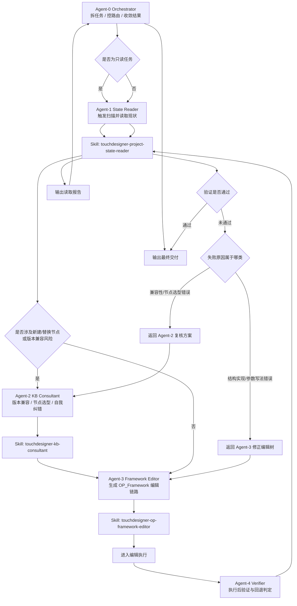

# AgenTD Multiagent 协作流程图

## 目标

这个流程设计用于把 TouchDesigner 自动化任务拆成多个专职智能体，避免单个智能体同时携带“用户目标、当前工程状态、知识库资料、编辑细节、验证结果”而造成上下文污染。

核心原则：

- 每个智能体只处理一种职责
- 智能体之间只传递结构化摘要，不传递整段原始上下文
- 三个核心技能只在最合适的环节触发
- 失败时按环节回退，不把全部上下文重新灌回所有智能体

## 推荐数量

推荐使用 **5 个智能体**。

这是当前项目最均衡的数量：

- 少于 5 个时，读取、选型、编辑、验证容易混在一起，污染上下文
- 多于 5 个时，协作成本和调度复杂度会上升，当前项目未必需要
- 5 个时刚好能把“读现状 / 查资料 / 改工程 / 做验证 / 统一调度”完全拆开

## 智能体分工

| 智能体 | 角色 | 主要职责 | 输入 | 输出 |
| --- | --- | --- | --- | --- |
| Agent-0 | Orchestrator | 接收用户请求、拆任务、路由、汇总结果、控制回环 | 用户目标 | TaskBrief / FinalReport |
| Agent-1 | State Reader | 刷新并读取当前 TD 工程状态 | TaskBrief | ProjectStateBrief |
| Agent-2 | KB Consultant | 做版本判断、节点选型、兼容性校验、自我纠错建议 | TaskBrief / ProjectStateBrief / CandidatePlan | CompatibilityBrief |
| Agent-3 | Framework Editor | 按 OP_Framework 协议生成编辑树与执行链路 | TaskBrief / ProjectStateBrief / CompatibilityBrief | EditPlanBrief / ExecutionResult |
| Agent-4 | Verifier | 验证执行后状态是否满足目标，并决定是否回退重试 | TaskBrief / ExecutionResult | ValidationBrief |

## 三个核心技能的嵌入位置

| 技能 | 挂载智能体 | 作用时机 | 产出 |
| --- | --- | --- | --- |
| `touchdesigner-project-state-reader` | Agent-1、Agent-4 | 执行前读取现状；执行后验证结果 | `ProjectStateBrief` / `ValidationStateBrief` |
| `touchdesigner-kb-consultant` | Agent-2 | 创建前查证；失败后做兼容性复核 | `CompatibilityBrief` |
| `touchdesigner-op-framework-editor` | Agent-3 | 将目标转成 `OP_Framework` 编辑树与执行链路 | `EditPlanBrief` / `ExecutionResult` |

## 主流程图



## 上下文隔离规则

为避免多智能体之间互相污染，流转时只允许传递以下摘要对象：

### 1. TaskBrief

- 用户目标
- 任务类型：读取 / 创建 / 修改 / 修复 / 验证
- 目标范围：`/project1` 或某个子网络
- 约束条件：版本、性能、是否允许 experimental、是否允许重建

### 2. ProjectStateBrief

- 来自 `touchdesigner-project-state-reader`
- 仅保留当前任务相关节点、连接、关键参数、非默认项
- 不默认传递整份 `OP_Information.json`
- 只在必要时附带局部 DAT 摘要

### 3. CompatibilityBrief

- 来自 `touchdesigner-kb-consultant`
- 仅保留候选节点、兼容性判断、风险替代路线、证据来源
- 不传整份知识库检索结果

### 4. EditPlanBrief

- 来自 `touchdesigner-op-framework-editor`
- 包含目标节点树、关键参数、连接、执行顺序
- 不把所有历史推理过程传给验证智能体

### 5. ValidationBrief

- 仅包含“成功 / 失败 / 差异 / 下一跳建议”
- 若失败，只返回最小修复信息给 Agent-2 或 Agent-3

## 推荐调度逻辑

### 场景 1：只读分析

- Agent-0 判断为只读任务
- 只调用 Agent-1
- Agent-1 用 `touchdesigner-project-state-reader`
- 直接输出结构化报告

### 场景 2：新建网络或效果

- Agent-0 先派 Agent-1 读取当前工程
- Agent-2 用 `touchdesigner-kb-consultant` 做版本与节点选型校验
- Agent-3 用 `touchdesigner-op-framework-editor` 生成编辑树并执行
- Agent-4 再次读取工程并验证结果

### 场景 3：修改现有网络

- Agent-1 先读现状
- 如果要改的节点、参数、家族都很明确，可直接跳过 Agent-2
- 如果涉及新家族、新节点、版本不确定、执行失败，再补 Agent-2
- Agent-3 执行修改
- Agent-4 负责回归验证

### 场景 4：执行失败后的自我纠错

- 如果失败原因是“节点/家族/版本路线不对”，回到 Agent-2
- 如果失败原因是“参数、路径、连接、树结构实现不对”，回到 Agent-3
- Agent-4 只负责判定失败类型，不直接改工程

## 为什么这版最适合当前项目

### 原因 1：与现有三个技能天然对齐

- 读取技能对应 Agent-1 / Agent-4
- 知识库技能对应 Agent-2
- 编辑技能对应 Agent-3

这避免了让一个智能体同时持有“全量工程状态 + 知识库检索 + 编辑协议细节”。

### 原因 2：把上下文污染切断在接口层

每个智能体只收到当前步骤所需的摘要：

- Reader 不需要知道完整编辑细节
- KB Consultant 不需要知道全部执行日志
- Editor 不需要加载整套知识库正文
- Verifier 不需要继承前序全部思维链

### 原因 3：失败回环明确

失败后不是把任务重新丢给全体智能体，而是只回退到对应的责任点：

- 兼容性问题回 Agent-2
- 实现问题回 Agent-3

这样才能真正减少无关上下文反复传播。

## 推荐的数据接口

```text
TaskBrief
	-> ProjectStateBrief
	-> CompatibilityBrief
	-> EditPlanBrief
	-> ValidationBrief
```

推荐约束：

- 每个 Brief 都限制字段数量
- 每个 Brief 都要有 `task_id`
- 每个 Brief 都要有 `scope`
- 每个 Brief 都要有 `next_action`
- 不允许跨智能体直接转发原始长文本

## 消息协议

推荐所有智能体统一使用同一层消息信封，避免每个智能体自行发明字段。

### 通用消息信封

```json
{
	"task_id": "td-20260405-001",
	"message_id": "msg-0001",
	"from_agent": "agent-0-orchestrator",
	"to_agent": "agent-1-state-reader",
	"message_type": "task_brief",
	"scope": "/project1/container1",
	"priority": "high",
	"payload": {},
	"next_action": "read_current_state"
}
```

### 字段约束

- `task_id`：同一用户任务全程不变
- `message_id`：单条消息唯一 ID
- `from_agent` / `to_agent`：固定角色名，不要混用临时别名
- `message_type`：严格限制为预定义类型
- `scope`：当前作用范围，默认 `/project1`
- `payload`：只放当前环节必要信息
- `next_action`：告诉下游智能体下一步要做什么，而不是让它自己猜

### 推荐的 message_type

- `task_brief`
- `project_state_brief`
- `compatibility_brief`
- `edit_plan_brief`
- `execution_result`
- `validation_brief`
- `retry_request`
- `final_report`

## 智能体输入输出 Schema

以下不是运行时强校验代码，而是最适合当前项目的结构约定。

### Agent-0 Orchestrator

**输入**

```json
{
	"user_goal": "把当前音频链路改成可切换双输入",
	"task_type": "modify",
	"scope": "/project1",
	"constraints": {
		"target_version": "2023.11600",
		"allow_experimental": false,
		"allow_rebuild": false
	}
}
```

**输出：TaskBrief**

```json
{
	"task_id": "td-20260405-001",
	"task_type": "modify",
	"goal": "把当前音频链路改成可切换双输入",
	"scope": "/project1",
	"constraints": {
		"target_version": "2023.11600",
		"allow_experimental": false,
		"allow_rebuild": false
	},
	"requires_state_read": true,
	"requires_kb_check": true,
	"requires_edit": true,
	"next_action": "dispatch_to_agent_1"
}
```

### Agent-1 State Reader

挂载技能：`touchdesigner-project-state-reader`

**输出：ProjectStateBrief**

```json
{
	"task_id": "td-20260405-001",
	"scope": "/project1",
	"summary": {
		"top_level_nodes": [
			{"name": "audiofilein1", "type": "audiofileinCHOP", "path": "/project1/audiofilein1"},
			{"name": "switch1", "type": "switchCHOP", "path": "/project1/switch1"}
		],
		"relevant_nodes": [
			"/project1/audiofilein1",
			"/project1/switch1",
			"/project1/audiodeviceout1"
		],
		"key_connections": [
			{"target": "/project1/switch1", "inputs": ["audiofilein1"]},
			{"target": "/project1/audiodeviceout1", "inputs": ["switch1"]}
		],
		"non_default_nodes": [
			"/project1/switch1"
		]
	},
	"evidence_files": [
		"OP_Information.json",
		"OP_Framework.json"
	],
	"next_action": "route_to_agent_2_or_agent_3"
}
```

### Agent-2 KB Consultant

挂载技能：`touchdesigner-kb-consultant`

**输出：CompatibilityBrief**

```json
{
	"task_id": "td-20260405-001",
	"scope": "/project1",
	"version_assumption": "2023.11600 stable",
	"compatible_choices": [
		{"entity": "switchCHOP", "reason": "稳定版本可用，适合输入切换"},
		{"entity": "audiofileinCHOP", "reason": "稳定版本可用，适合作为音频源"}
	],
	"rejected_choices": [
		{"entity": "POP family", "reason": "与当前任务无关且版本风险高"}
	],
	"evidence": [
		{"source": "family_compatibility.jsonl", "key": "CHOP"},
		{"source": "version_compatibility.jsonl", "key": "switchCHOP"}
	],
	"recommendation": "使用 CHOP 路线，不引入 experimental 家族",
	"next_action": "route_to_agent_3"
}
```

### Agent-3 Framework Editor

挂载技能：`touchdesigner-op-framework-editor`

**输出：EditPlanBrief**

```json
{
	"task_id": "td-20260405-001",
	"scope": "/project1",
	"edit_goal": "新增第二个音频输入并接入 switch1",
	"framework_changes": [
		{"path": "/project1/audiofilein2", "type": "audiofileinCHOP", "action": "create"},
		{"path": "/project1/switch1", "type": "switchCHOP", "action": "modify_inputs"}
	],
	"execution_chain": [
		"write_framework_json",
		"reload",
		"replicate_framework",
		"save_project"
	],
	"risk_points": [
		"switch1 输入端口数量需与目标连接一致"
	],
	"next_action": "route_to_agent_4"
}
```

**输出：ExecutionResult**

```json
{
	"task_id": "td-20260405-001",
	"status": "executed",
	"executed_commands": [
		"write_framework_json",
		"reload",
		"replicate_framework",
		"save_project"
	],
	"runtime_notes": [],
	"next_action": "verify_project_state"
}
```

### Agent-4 Verifier

挂载技能：`touchdesigner-project-state-reader`

**输出：ValidationBrief**

```json
{
	"task_id": "td-20260405-001",
	"status": "pass",
	"result_type": "goal_match",
	"verified_changes": [
		"/project1/audiofilein2 created",
		"/project1/switch1 now receives two inputs"
	],
	"remaining_issues": [],
	"retry_target": "",
	"next_action": "return_to_agent_0"
}
```

## 回退协议

一旦验证失败，Agent-4 不直接修改工程，而是只发回一条 `retry_request`。

```json
{
	"task_id": "td-20260405-001",
	"message_type": "retry_request",
	"failure_type": "framework_failure",
	"failure_summary": "switch1 仍只有一个输入",
	"retry_target": "agent-3-framework-editor",
	"suggested_fix": "补写 switch1 的第二路输入连接",
	"next_action": "rebuild_edit_plan"
}
```

推荐失败分类：

- `compatibility_failure`
- `framework_failure`
- `execution_failure`
- `goal_mismatch`

## 项目落地目录结构

如果你后续真的把 multiagent 落到项目里，我建议按下面这个结构继续扩展，而不是把所有逻辑继续堆进 `tools/`。

```text
AgenTD/
	agents/
		orchestrator/
			prompts/
			schemas/
		state_reader/
			prompts/
			schemas/
		kb_consultant/
			prompts/
			schemas/
		framework_editor/
			prompts/
			schemas/
		verifier/
			prompts/
			schemas/
	skills/
		touchdesigner-project-state-reader/
		touchdesigner-kb-consultant/
		touchdesigner-op-framework-editor/
	tools/
		web_bridge.py
		replicate_framework.py
		send_td_cmds.py
	web/
		app.js
		index.html
		style.css
	runtime/
		briefs/
		logs/
		retries/
	OP_Framework.py
	OP_Information.py
	OP_Framework.json
	OP_Information.json
	MULTIAGENT_WORKFLOW.md
	README.md
```

### 目录职责建议

- `agents/`：放多智能体专属 prompt、schema、角色配置
- `skills/`：放真正可分发的技能资产
- `tools/`：放桥接执行与本地调试工具
- `runtime/briefs/`：放结构化 Brief 快照，便于调试协作链路
- `runtime/logs/`：放多智能体执行日志
- `runtime/retries/`：放失败回退记录

## 最小实现顺序

如果你下一步开始真正实现 multiagent，建议按以下顺序推进：

1. 先实现 Agent-0 的任务分类与路由
2. 再实现 Agent-1 与 Agent-4 共用的读取/验证接口
3. 再把 Agent-2 绑定到知识库技能
4. 然后让 Agent-3 只负责输出 `EditPlanBrief`
5. 最后再接入真实执行与失败回环

这样做的好处是：

- 先把职责边界固化
- 再把技能逐个接入
- 最后才处理执行复杂度

## 落地建议

### 第一阶段

- 先按这 5 个智能体实现逻辑分工
- 暂时允许 Agent-0 做最简单的任务分类与汇总
- 三个技能分别绑定到 Agent-1、Agent-2、Agent-3

### 第二阶段

- 给 Agent-4 增加更细的失败分类模板
- 把验证结果细分为：
	- `compatibility_failure`
	- `framework_failure`
	- `execution_failure`
	- `goal_mismatch`

### 第三阶段

- 当项目进一步变大时，再考虑把 Agent-3 拆成：
	- Planner
	- Executor

当前阶段不建议一开始就拆得更细，否则调度复杂度会高于收益。

## 一句话结论

当前项目最适合的 multiagent 架构是：

**1 个调度智能体 + 4 个专职智能体**，

并将三个核心技能分别嵌入 **读取、知识校验、编辑执行** 三个关键环节，用 **验证智能体** 控制回环，这样最能避免上下文污染，同时保持执行链路清晰稳定。
